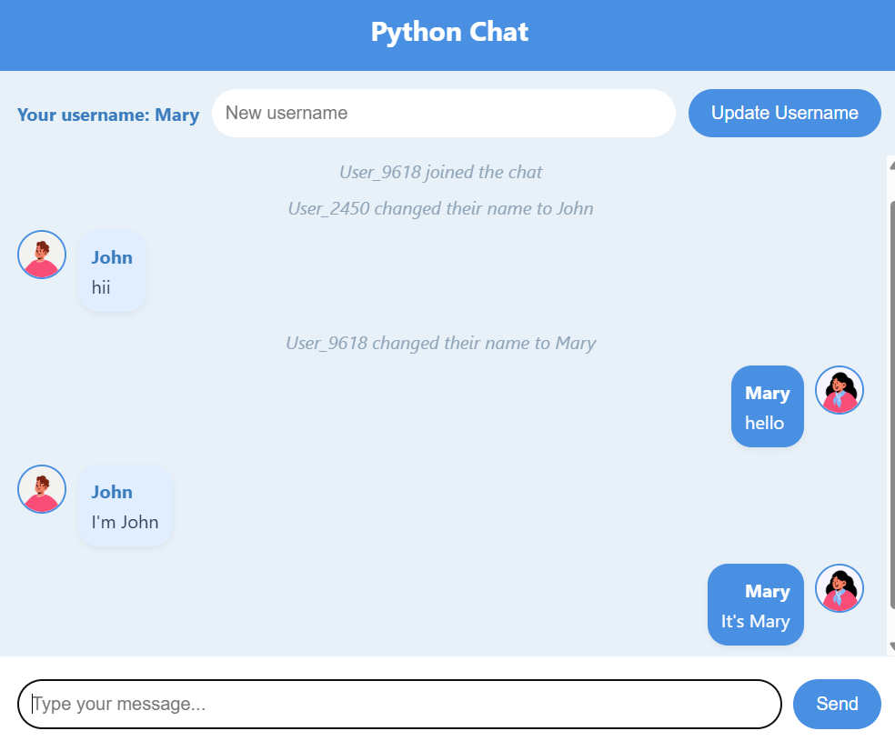
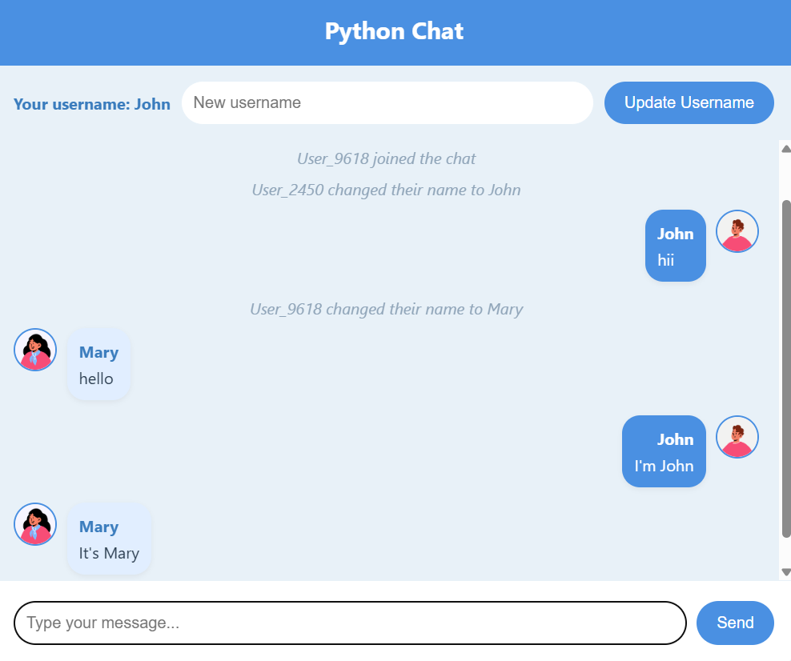

# PYTHON REAL-TIME CHAT APPLICATION

## OVERVIEW
This application is built with Flask and Flask-SocketIO to enable live, two-way communication in a browser-based chat room. Users get random usernames, automatically assigned avatars (via the Genderize.io API), and can see messages in real time.

  
  

## Live Link
   https://python-chat-app-isfe.onrender.com

## KEY FEATURES
- Real-Time Messaging: Multiple users can join and send messages instantly.
- Automatic Username: Users get something like “User_1234” when they connect.
- Avatar Assignment: The app calls the Genderize.io API to guess gender and pick a matching avatar.
- Username Updates: Users can change their username on the fly, broadcasting the change to everyone.
- System Notifications: Join and leave events are announced to all connected users.

## TECH STACK
- Python for backend logic
- Flask as the main web framework
- Flask-SocketIO for real-time WebSocket communication
- Requests library for calling the Genderize.io API
- HTML, CSS, JavaScript on the frontend

## USAGE
1) Open multiple browser tabs, each simulating a different user.
2) Send messages by typing into the text box and pressing Enter.
3) Update your username to broadcast the change instantly.
4) Observe real-time join/leave notifications and messages.

## HOW IT WORKS
- Flask-SocketIO: Manages WebSocket connections for real-time data.
- Automatic Username: Each new user gets a random name like “User_1234”.
- Genderize.io API: The numeric portion of the username is used to guess “male” or “female,” then an avatar URL is constructed accordingly.
- Broadcasting: All major events (user joined, new message, username updated) are broadcast to everyone.
- Frontend: Socket.IO (client-side) listens for these events and updates the chat interface in real time.
